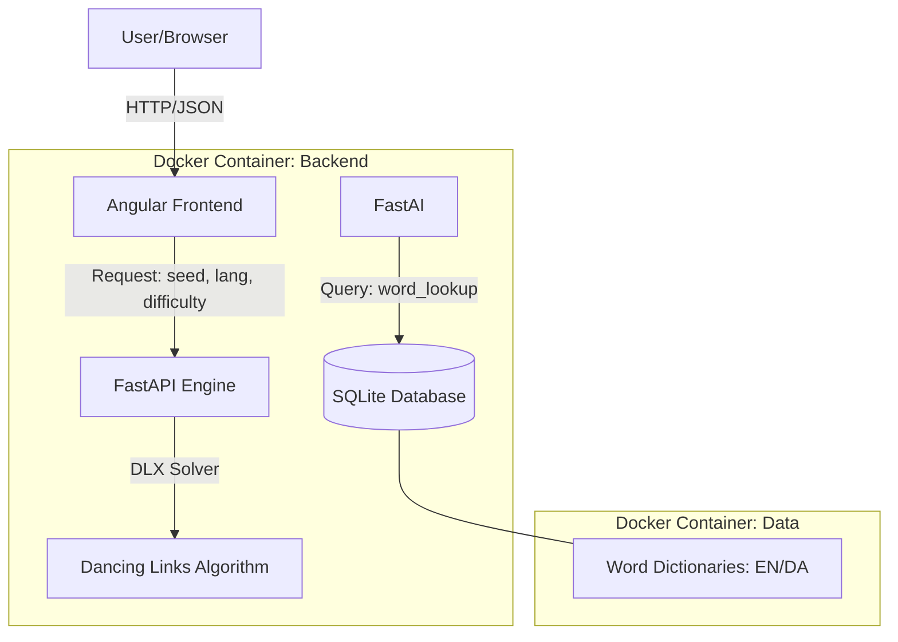
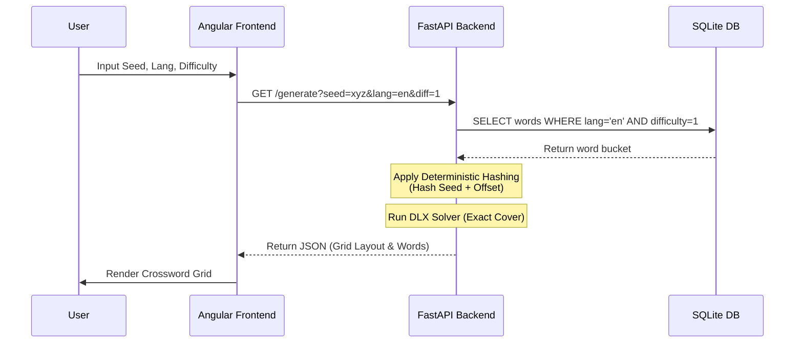

# Crossword Generator 🧩

A high-performance, deterministic crossword generation system supporting both **English** and **Danish**. Using advanced Constraint Satisfaction Problem (CSP) algorithms, this engine allows users to recreate identical puzzles using unique seeds and varying difficulty levels.

## ✨ Key Features

- **Deterministic Generation**: Use a unique `seed` to perfectly recreate the same puzzle layout every time.
- **Multi-Language Support**: Optimized word databases for English (`en`) and Danish (`da`).
- **Adjustable Difficulty**: Three distinct difficulty tiers based on word frequency and complexity.
- **High Performance**: Powered by the **Dancing Links (DLX)** algorithm for efficient exact cover solving.
- **Containerized**: Ready to deploy with a single command using Docker Compose.

## 🏗️ System Architecture

The system follows a decoupled Client-Server architecture.



## 🔄 Generation Workflow

The generation process is designed for $O(1)$ lookup complexity regarding word retrieval and efficient solving.



## 🛠️ Technology Stack

| Layer | Technology |
| :--- | :--- |
| **Frontend** | Angular, Tailwind CSS, TypeScript |
| **Backend** | Python, FastAPI, Dancing Links (DLX) |
| **Database** | SQLite (Optimized with multi-level indexing) |
| **DevOps** | Docker, Docker Compose |

## 📁 Project Structure

```text
.
├── backend/          # FastAPI application & DLX logic
├── frontend/         # Angular application & UI components
├── data/             # SQLite database and word dictionaries (EN/DA)
├── docker/           # Dockerfiles and orchestration config
└── README.md         # Project documentation
```

## 🚀 Getting Started

### Prerequisites
- [Docker](https://www.docker.com/)
- [Docker Compose](https://docs.docker.com/compose/)

### Running with Docker

Clone the repository and run:

```bash
docker-compose up --build
```

Once started, the application will be available at `http://localhost:4200`.

## 📊 Database Schema

The word lookup is optimized using a composite index on `(lang, length, difficulty_tier)` to ensure near-instantaneous retrieval during the generation phase.

```sql
CREATE TABLE words (
    id INTEGER PRIMARY KEY AUTOINCREMENT,
    word TEXT NOT NULL,
    lang TEXT NOT NULL,       -- 'en' or 'da'
    length INTEGER NOT NULL,  -- length of the word
    difficulty_tier INTEGER NOT NULL -- 1 (easy), 2 (medium), 3 (hard)
);

CREATE INDEX idx_word_lookup ON words (lang, length, difficulty_tier);
```

---
*Developed with precision for deterministic puzzle enthusiasts.*
